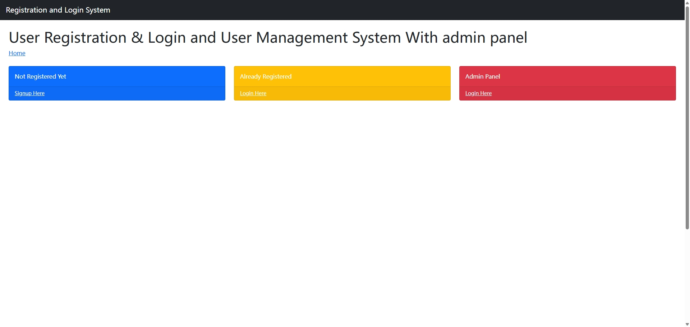
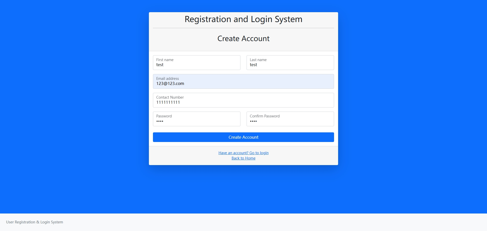
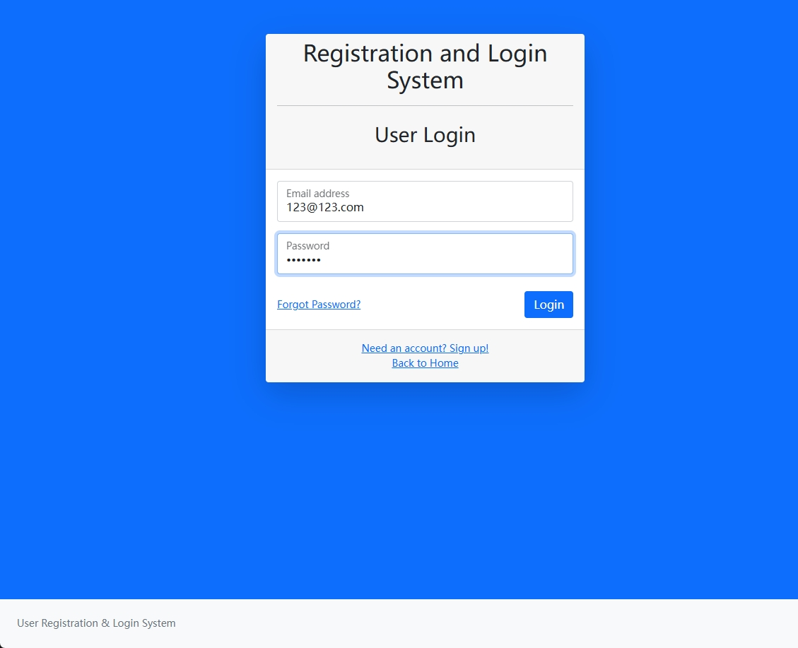
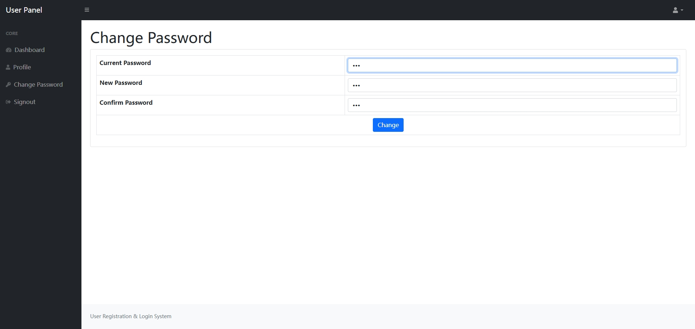
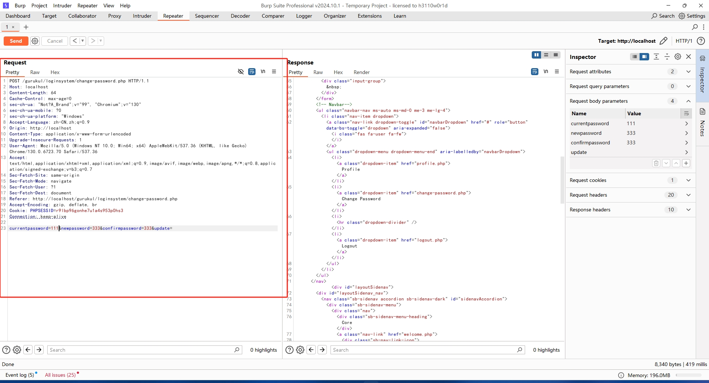
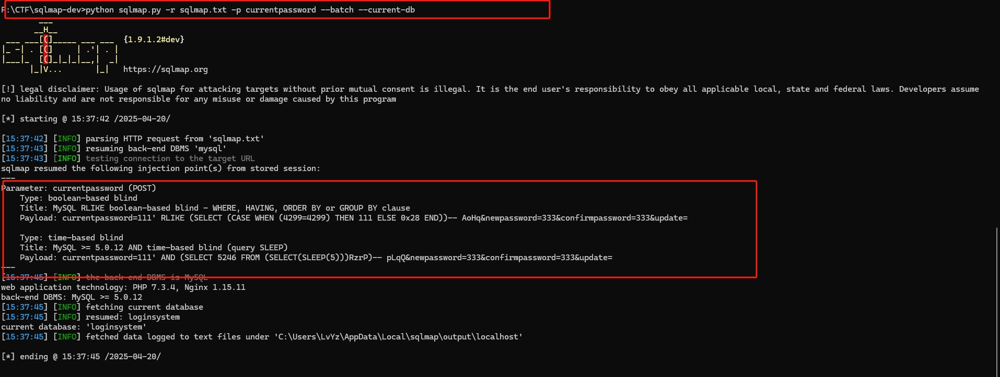
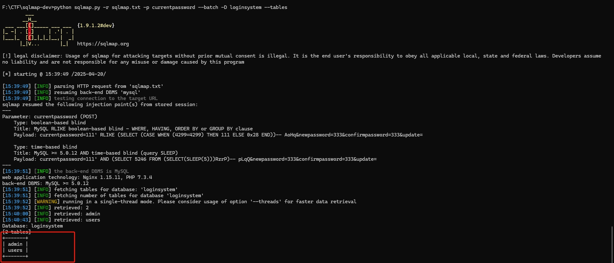

## Vulnerability Description

SQL Injection was found in the `/change-password.php` page of the PHPGurukul User Registration & Login and User Management System V3.3. Allows remote attackers to execute arbitrary SQL command via the `currentpassword` parameter in a POST HTTP request.

|            **Field**             |                         **Details**                          |
| :------------------------------: | :----------------------------------------------------------: |
|       **Affected Vendor**        |            [ PHPGurukul](https://phpgurukul.com/)            |
|    **Affected Product Name**     | User Registration & Login and User Management System With admin panel |
| **Product Official Website URL** | https://phpgurukul.com/user-registration-login-and-user-management-system-with-admin-panel/ |
|     **Affected Components**      | \- **Version:** - V 3.3 \- **Affected Code File:** /change-password.php \- **Affected Parameter:** currentpassword \- **Method:** POST \- **Type:** boolean-based blind |

## Steps to Reproduce:

**Step 1:** Click on `Not Registered Yet` to Sign up for a new account

**Step 2:** Click on `Already Registered` to login

**Step 3:** Click on `Change Password` to update your password. Enable intercept in burpsuite to cpature the request and click on `Change`

**Step 4:** Copy the request request and save in a file. ( Here name is given `sqlmap.txt`)

**Step 5:** Now run `sqlmap` command and also specify the parameter `python sqlmap.py -r sqlmap.txt -p currentpassword --batch --current-db`, and observer POST parameter `currentpassword` is vulnerable.

`currentpassword` parameter is vulnerable with `boolean-based blind` and `time-based blind` Type SQL Injection. Current database is retrived sucessfully.

**Step 6:** Further more table are also retrived sucessfully for current database `loginsystem`

## Mitigation/recommendations

1. **Use prepared statements and parameter binding:**
   Preparing statements can prevent SQL injection as they separate SQL code from user input data. When using prepare statements, the value entered by the user is treated as pure data and will not be interpreted as SQL code.
2. **Input validation and filtering:**
   Strictly validate and filter user input data to ensure it conforms to the expected format.
3. **Minimize database user permissions:**
   Ensure that the account used to connect to the database has the minimum necessary permissions. Avoid using accounts with advanced permissions (such as' root 'or' admin ') for daily operations.
4. **Regular security audits:**
   Regularly conduct code and system security audits to promptly identify and fix potential security vulnerabilities.